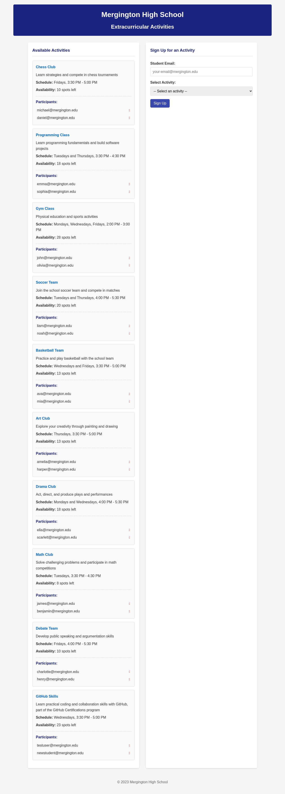
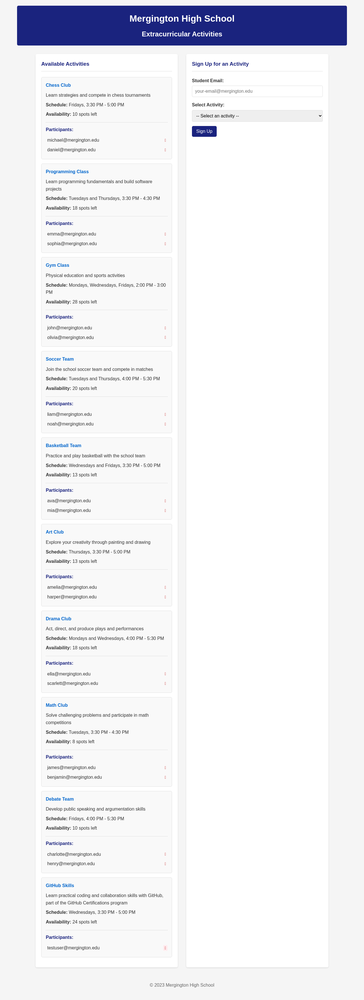

# Activity Signup Flow QA

This document captures the manual verification of the activity signup and sign-out flow performed on 2025-11-20 using Playwright against `https://verbose-space-barnacle-vpx9xxjvpgf69g-8000.app.github.dev/`.

## Scenario Overview
- Viewport forced to 1280x720 to mimic a desktop layout.
- Test account: `newstudent@mergington.edu`.
- Activity under test: **GitHub Skills**.

## Steps and Expected Outcomes
1. Load the Activities page. The signup form should render alongside the populated activities list.
2. Submit the form with the test account and GitHub Skills selected. Expect a success banner, the availability count decrementing, and the new email appearing in the participants list.
3. Click the corresponding delete control (❌) beside the new participant to sign out. Expect a success banner, the participant entry disappearing, and the availability count returning to its previous value.

## Visual Record
| Step | Description | Screenshot |
| --- | --- | --- |
| 1 | Form ready for desktop sign-up |  |
| 2 | Successful sign-up confirmation |  |
| 3 | Participant list after sign-out |  |

Screenshots are stored in `.playwright-mcp/` at the repository root so they can be reused in future documentation or regression tracking.

## Follow-ups
- Automate this flow with an end-to-end Playwright test so the regression can run in CI.
- Extend coverage to additional activities and error cases (invalid email, duplicate signup).
